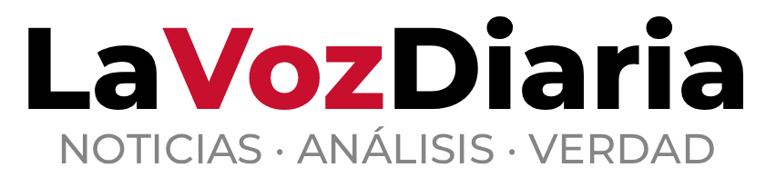

<p align="center">
  
</p>

Portal de noticias argentino construido con Next.js, Supabase y Tailwind CSS. Información veraz sobre Política, Deportes, Economía, Internacionales y Tucumán.

## Stack

- **Frontend:** Next.js 16 (App Router), React 19, Tailwind CSS 4
- **Backend:** Supabase (Auth, Database, Storage)
- **Estado:** Zustand
- **Animaciones:** Motion
- **Deploy:** Netlify
- **Noticias:** FreeNewsApi (sincronización con cache en Supabase)

## Funcionalidades

### Lectura de noticias
- Página de inicio con slider hero, secciones por categoría y artículos urgentes
- Secciones: Política, Deportes, Economía, Internacionales y Tucumán
- 3 layouts de artículo: **Urgente** (ancho completo, fondo rojo), **Destacada** (2 columnas), **Normal** (1 columna)
- Detalle de cada nota con contenido completo y fuente original
- Noticias de último momento (breaking news)
- Comentarios en cada nota
- Sistema de favoritos para usuarios registrados
- Botones de compartir en redes sociales

### Autenticación y perfiles
- Registro e inicio de sesión con email/contraseña
- Recuperación y actualización de contraseña
- Perfil de usuario con avatar y nombre completo
- 4 roles de usuario:

| Rol | Ver contenido | Comentar | Panel admin |
|---|---|---|---|
| `user` | ✅ | ✅ | ❌ |
| `editor` | ✅ | ✅ | ✅ Notas + Comentarios |
| `admin` | ✅ | ✅ | ✅ Todo |
| `suspended` | ✅ | ❌ | ❌ |

### Panel de administración
- **Notas:** Crear, editar, eliminar y activar/desactivar artículos con layout urgente/destacada/normal
- **Comentarios:** Moderar y eliminar comentarios
- **Avisos:** Sistema completo de publicidad (leaderboard, rectangle, modal, in-feed, sticky footer)
- **Usuarios:** Gestionar roles (admin, editor, usuario, suspendido)

### Sistema de publicidad
- 6 formatos: leaderboard, rectangle, sidebar, modal, in-feed y sticky footer
- Activación/desactivación por aviso con prioridad y vigencia
- Sección por aviso o global

### Sincronización de noticias
- Sync automático desde FreeNewsApi con cache en Supabase
- Backfill de detalles bajo demanda (imágenes, contenido completo)
- Endpoint manual de sync y backfill para Netlify

## Estructura del proyecto

```
src/
├── app/
│   ├── page.tsx                    # Homepage
│   ├── [section]/[id]/page.tsx    # Detalle de artículo
│   ├── politica/                   # Sección Política
│   ├── deportes/                   # Sección Deportes
│   ├── economia/                   # Sección Economía
│   ├── internacionales/            # Sección Internacionales
│   ├── tucuman/                    # Sección Tucumán
│   ├── login/                      # Login
│   ├── register/                   # Registro
│   ├── perfil/                     # Perfil de usuario
│   └── admin/                      # Panel de administración
│       ├── page.tsx                 # Avisos (solo admin)
│       ├── articles/               # Notas (admin + editor)
│       ├── comments/               # Comentarios (admin + editor)
│       ├── users/                  # Usuarios (solo admin)
│       └── ads/                    # Gestión de avisos (solo admin)
├── components/
│   ├── admin/                      # Componentes del panel admin
│   │   ├── AdminLayout.tsx         # Layout con tabs según rol
│   │   ├── ArticleForm.tsx         # Formulario de notas
│   │   ├── ToggleRoleForm.tsx      # Cambio de roles
│   │   └── ...
│   ├── animate/                    # Animaciones de entrada
│   ├── ArticleCard.tsx             # Card de artículo (5 variantes)
│   ├── HeroSlider.tsx              # Slider del hero
│   ├── BreakingNews.tsx            # Barra de noticias urgentes
│   ├── CommentForm.tsx             # Formulario de comentarios
│   ├── ShareButtons.tsx            # Botones de compartir
│   └── UserDropdown.tsx            # Menú de usuario
└── lib/
    ├── api.ts                      # Fetch de noticias con cache
    ├── sync-news.ts                # Sincronización FreeNewsApi → Supabase
    ├── articles.ts                 # CRUD de artículos custom
    ├── ads.ts                      # Sistema de avisos
    ├── store/                      # Zustand stores (auth, comments, favorites)
    ├── supabase/                   # Clientes Supabase (browser, server, middleware)
    └── types.ts                    # Tipos y configuración de secciones
```

## Configuración

### Variables de entorno

```env
# Supabase
NEXT_PUBLIC_SUPABASE_URL=https://tu-proyecto.supabase.co
NEXT_PUBLIC_SUPABASE_ANON_KEY=tu-anon-key
SUPABASE_SERVICE_ROLE_KEY=tu-service-role-key

# FreeNewsApi
FREENEWS_API_KEY=tu-api-key
```

### Instalación

```bash
npm install
npm run dev
```

### Deploy en Netlify

1. Conectar el repo a Netlify
2. Configurar las variables de entorno en Netlify
3. Agregar `NODE_TLS_REJECT_UNAUTHORIZED=0` en variables de entorno (necesario para FreeNewsApi)
4. El build command es `npm run build`

### Sincronización manual

En Netlify, ejecutar estos endpoints al inicio de cada sesión:

```
GET /api/sync-news         # Sincroniza títulos de todas las secciones
GET /api/backfill-details   # Completa detalles (imágenes, contenido) de artículos
```

## Licencia

Privado — todos los derechos reservados.